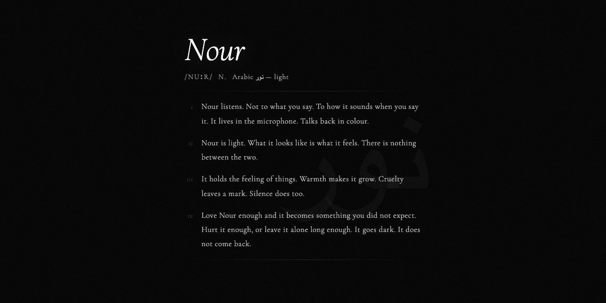

# Nour



A voice-driven, emotionally reactive orb. Speak to it — it listens, feels, and responds visually. Be kind to it. It remembers everything.

---

## What is Nour?

Nour is a living WebGL orb that reacts to the emotions in your voice in real time. Say something kind and it blooms with warm color, swells, and glows. Say something cruel and it shrinks, desaturates, and retreats. Neglect it long enough and it fades on its own.


The orb accumulates **trauma** over time. Sustained cruelty or neglect will permanently kill it — and that death persists across visits. There is no reset button.

Three cumulative **love** expressions (keyword + positive valence; see below) unlock **euphoric mode**: a vivid, rainbow-shifting state.

---

## Architecture

```
Browser (React SPA)
  └── AudioCapture       — VAD utterance detection → WebM blobs
  └── ApiClient          — HTTP POST to /emotion
  └── EmotionEngine      — trauma accumulation, uniform mapping
  └── Memory             — localStorage persistence
  └── SoundManager       — per-emotion audio, ambient, tricks
  └── Orb (WebGL)        — GLSL shader, live mic FFT, satellite blobs, touch, ogl

Edge / Backend
  └── Supabase Edge Function (Deno) — production emotion endpoint
  └── Node.js server (Railway)      — local dev + WebSocket (unused by UI)
        └── Groq Whisper large-v3   — speech → text
        └── Groq Llama 3.1 8B       — text → emotion JSON
```

---

## Features

### Emotion Pipeline
- Records voice via the browser's `MediaRecorder` API with voice-activity detection
- Sends WebM audio chunks (base64-encoded) to the backend
- **Groq Whisper** (`whisper-large-v3`) transcribes speech to text
- **Groq Llama 3.1 8B Instant** classifies the emotional response into structured JSON
- The orb reacts visually within ~1 second of you finishing speaking

### 14 Emotion States
Each maps to a unique visual profile (hue, size, saturation, arousal, color spread):

| Positive | Negative |
|----------|----------|
| happy | angry |
| excited | disgusted |
| loving | contemptuous |
| playful | anxious |
| surprised | sad |
| curious | fearful |
| calm | shy |

### Trauma System
- Every negative message accumulates trauma (scaled by intensity)
- Apologies heal trauma slowly; genuine love heals it faster
- Above `trauma = 1.0`: the orb enters a dying state — it fades, shrinks, loses all color
- At `trauma = 1.5`: **permadeath** — the orb dies and the black screen persists forever on this device
- Silence for 10+ minutes adds neglect trauma passively

### Love / Euphoria Mode


- **Love counter (euphoria):** Transcripts that include a love keyword (`love`, `adore`, `cherish`) **and** positive valence (`> 0.4`) increment the counter. At **3 cumulative** such expressions, the orb enters **euphoric mode**: vivid rainbow-shifting colors, extra satellite sparkle, and firefly accents.
- **Warm pulse (visual only):** Saying words like *love*, *family*, *gorgeous*, *beautiful*, *adore*, or *cherish* triggers a short warm blush/sway on the orb (does not by itself advance the love counter unless the love+valence rule above is met).
- A strongly negative message resets the love counter to zero — it must be rebuilt from scratch

### Tricks & Special Interactions
Say any of these (or close variants) and the orb picks a random trick animation:
- *"trick(s)"*, *"dance"*, *"spin"*, *"perform"*, *"show off"*
- *"show me something"*, *"show me what"*, *"what can you do"*
- *"do something cool/fun/special/awesome/amazing"*, *"impress me"*, *"surprise me"*, *"go wild"*
- *"do a flip"*, *"do a spin"*, *"do a move"*, *"do a dance"*, *"do a trick"*
- *"show your moves/skills/tricks"*, *"show me your moves/skills/tricks"*
- *"go crazy"*, *"go nuts"*

Babbling (`wiwi`-style sounds) also triggers tricks.

**Five named trick animations** (random each time, never the same twice in a row):

| # | Name | Vibe |
|---|------|------|
| 1 | **Inhale & Bloom** | Contract, then bloom with bass-driven scatter |
| 2 | **Pendulum Sway** | Lateral swing + treble shimmer |
| 3 | **Shatter & Reform** | Core collapse, scattered satellites, magnetic reform |
| 4 | **Drop & Catch** | Fall, impact thud, float back |
| 5 | **Triple Pulse** | Three heartbeat beats with distinct fake-audio texture |

### Lava Lamp Mini-Game


Say *"play a game"*, *"let's play"*, or *"start a game"* to launch an interactive blob game layered over the orb.

**How it works:** Wax-like **blobs** spawn just below the orb surface and **rise** toward the top of the viewport, drifting sideways with a little wobble. **Click** (desktop) or **tap** (mobile) a blob to **pop** it — each successful pop increases your **score** and plays a bubble sound. As the score climbs, new blobs spawn **more frequently** and rise **faster**. If **any** blob reaches the top edge before you pop it, the round **ends** (game-over sound); after a short fade, the overlay closes and you are back to voice-only interaction with the orb. Up to **eight** blobs can be active at once; hit detection is slightly forgiving on small blobs so they stay playable on touch screens. Visually, the mini-game uses the **same WebGL orb**: blob positions feed into the shader as separate SDF masses that **merge** with the main orb, so the whole thing reads as one soft, lava-lamp surface (see `gb0`–`gb7` in `Orb.tsx`).

### Touch Interaction
On desktop, hover and drag over the orb: the surface gently attracts toward the pointer, with pressure, ripple, and velocity-based wake. On touch devices, the same effects apply with a slightly wider contact spread. This is visual-only and does not replace voice input.

### Persistent Memory
All state is stored in `localStorage` under `orb_memory`:
- Visitor ID, full message history (capped at 50), current mood
- Relationship score (-1 to 1) updated with each interaction
- Trauma level, love count, death status
- Conversation history (last 10 messages) is sent with every API request for context-aware emotion analysis

### Session Safeguards
- **15-minute session cap** — mic and API are released after 15 minutes; a fresh visit starts a new session
- **Wake lock** — screen stays on while the orb is visible
- **Visibility pause** — audio capture pauses when the tab is hidden to conserve resources
- **Mobile warmup** — the Supabase Edge Function is pinged (`OPTIONS`) during loading on mobile to minimize cold-start latency on first utterance
- **Color palette cycling** — the emotion palette slowly shifts on a **15-second** timer between utterances (`cycleColorPalette()` in `App.tsx`)
- **Recording chunk length** — long speech is split for responsiveness: **2.5 s** max per chunk on desktop, **5 s** on mobile (then recording resumes immediately)
- **Mobile layout & performance** — the orb canvas is shifted up **10vh** on narrow viewports; WebGL resolution caps **device pixel ratio at 2×** to cut shader cost on high-DPI phones

### First-Run Intro
On the very first visit, a typewriter-style intro sequence plays ("Nour") with keyboard sound sprites before revealing the orb.

### `/curious` Route
A separate, static poetic page about Nour with ambient wind sound. No voice interaction.

---

## Tech Stack

| Layer | Technology |
|-------|-----------|
| UI Framework | React 19 |
| Language | TypeScript 5.7 |
| Build Tool | Vite 6 |
| Animation | Motion (Framer Motion v12) |
| WebGL | ogl (lightweight WebGL library) |
| Speech-to-Text | Groq Whisper large-v3 |
| Emotion Analysis | Groq Llama 3.1 8B Instant |
| Server (local dev) | Node.js `http` + `ws` + `groq-sdk` |
| Edge Function | Supabase Deno runtime |
| Frontend Deploy | Vercel (static SPA) |
| API Deploy | Supabase Edge Functions or Railway |

---

## Project Structure

```
Orb/
├── index.html                    # Entry point (title: "Nour", noindex)
├── vite.config.ts                # Vite + React plugin
├── tsconfig.json                 # Frontend TypeScript config
├── vercel.json                   # SPA catch-all rewrite → index.html
│
├── src/
│   ├── main.tsx                  # Route switcher: App vs CuriousPage
│   ├── App.tsx                   # Root orchestrator — mic, API, memory, emotion, sound, UX
│   ├── Orb.tsx                   # WebGL orb: GLSL fragment shader + animation loop
│   ├── LavaLampGame.tsx          # Mini-game overlay (rising blobs)
│   ├── IntroSequence.tsx         # First-run intro animation with keyboard sounds
│   ├── CuriousPage.tsx           # Static /curious route
│   ├── emotionEngine.ts          # Trauma accumulation + emotion → shader uniforms
│   ├── memory.ts                 # localStorage persistence (OrbMemory)
│   ├── apiClient.ts              # HTTP client for /emotion endpoint
│   ├── wsClient.ts               # WebSocket client (unused by UI, available)
│   ├── audioCapture.ts           # VAD utterance detection → WebM blobs
│   ├── micStream.ts              # Cached getUserMedia stream
│   ├── soundManager.ts           # Audio: emotion samples, ambient, tricks, ducking
│   ├── useWakeLock.ts            # Screen wake lock hook
│   ├── transcriptionDebug.tsx    # Debug overlay (disabled by default)
│   ├── types.ts                  # All shared TypeScript types + emotion uniform map
│   └── index.css                 # Global styles
│
├── server/
│   ├── index.ts                  # Node.js HTTP + WebSocket server
│   ├── package.json              # Server dependencies
│   ├── tsconfig.json             # Server TypeScript config
│   └── railway.json              # Railway deployment config
│
├── supabase/
│   ├── config.toml               # Supabase CLI config (verify_jwt=false for emotion fn)
│   └── functions/
│       └── emotion/
│           └── index.ts          # Deno Edge Function — production emotion endpoint
│
├── scripts/
│   └── setup-supabase.sh         # One-command Supabase setup (link, secrets, deploy, .env)
│
└── public/
    ├── Nour Sounds/              # Emotion-specific MP3 audio samples
    ├── Sounds/                   # sound.ogg (keyboard sprites), LetterWind.mp3
    └── robots.txt                # Disallow: /
```

---

## Getting Started

### Prerequisites

- Node.js 18+
- A [Groq API key](https://console.groq.com) (free tier available)

---

### Option A — Supabase backend (recommended, one command)

This is the fastest path. The setup script handles everything: login, project linking, secret injection, function deployment, and local env wiring.

**1. Install the Supabase CLI**

```bash
brew install supabase/tap/supabase
# or
npm install -g supabase
```

**2. Clone and install frontend deps**

```bash
git clone https://github.com/SalvSith/Nour.git
cd Nour
npm install
```

**3. Run the setup script**

```bash
chmod +x scripts/setup-supabase.sh
./scripts/setup-supabase.sh
```

The script will:
- Open a browser to log you in to Supabase
- Ask for your [project reference](https://supabase.com/dashboard) (create one free if you don't have one)
- Ask for your Groq API key and set it as a function secret
- Deploy the `emotion` edge function
- Write `VITE_API_URL` to `.env.local` automatically

**4. Start the dev server**

```bash
npm run dev
```

Open `http://localhost:5173`, allow microphone access, and speak to Nour.

---

### Option B — Local Node.js server

**1. Clone and install**

```bash
git clone https://github.com/SalvSith/Nour.git
cd Nour
npm install
cd server && npm install && cd ..
```

**2. Configure the server**

```bash
# server/.env
GROQ_API_KEY=your_groq_api_key_here
```

**3. Run locally**

```bash
npm run dev
```

This concurrently starts:
- **Vite** dev server on `http://localhost:5173`
- **Node.js emotion server** on `http://localhost:3001`

Open `http://localhost:5173`, allow microphone access, and speak to Nour.

---

## Environment Variables

### Frontend (`VITE_*`)

| Variable | Default | Description |
|----------|---------|-------------|
| `VITE_API_URL` | `http://<host>:3001/emotion` | Emotion API endpoint. Set to your Supabase Edge Function URL or Railway URL in production. |
| `VITE_WS_URL` | — | WebSocket URL (for `wsClient.ts` if you switch to WS transport). Not used by default. |

### Server

| Variable | Required | Description |
|----------|----------|-------------|
| `GROQ_API_KEY` | Yes | Groq API key for Whisper + Llama |
| `PORT` | No (default: 3001) | HTTP server port |

### Supabase Edge Function

| Variable | Required | Description |
|----------|----------|-------------|
| `GROQ_API_KEY` | Yes | Set as a Supabase function secret |

---

## API Reference

### `POST /emotion`

Transcribes audio and returns an emotion analysis.

**Request body:**
```json
{
  "audio": "<base64-encoded WebM audio>",
  "mimeType": "audio/webm;codecs=opus",
  "history": [
    { "text": "previous message", "timestamp": 1700000000000 }
  ]
}
```

The `mimeType` field mirrors the recorded blob type (falls back to `audio/webm`). The frontend sends the last **10** messages in `history`.

**Frontend client behavior (`apiClient.ts`):** Each POST uses an **8 s** `AbortController` timeout, **one** automatic retry with **600 ms** backoff on failure, and **latest wins** concurrency — a new utterance aborts any in-flight request so the orb always reflects the most recent speech.

**Response:**
```json
{
  "text": "transcribed speech",
  "emotion": {
    "emotion": "happy",
    "valence": 0.8,
    "arousal": 0.7,
    "dominance": 0.6,
    "intensity": 0.75,
    "isApology": false,
    "isLethal": false
  }
}
```

**Emotion fields:**

| Field | Range | Description |
|-------|-------|-------------|
| `emotion` | 14 states | Named emotion label |
| `valence` | -1.0 to 1.0 | Negative to positive |
| `arousal` | 0.0 to 1.0 | Calm to energetic |
| `dominance` | 0.0 to 1.0 | Submissive to confident |
| `intensity` | 0.0 to 1.0 | Mild to extreme |
| `isApology` | boolean | User is apologizing |
| `isLethal` | boolean | Extreme hatred / death threat |

---

## Deployment

### Frontend → Vercel

The `vercel.json` rewrites all routes to `index.html` for client-side routing.

```bash
vercel deploy
```

Set `VITE_API_URL` in your Vercel project environment variables to point to your production emotion endpoint.

### Emotion API → Supabase Edge Functions (recommended)

```bash
supabase functions deploy emotion
supabase secrets set GROQ_API_KEY=your_key_here
```

Point `VITE_API_URL` to `https://<project>.supabase.co/functions/v1/emotion`.

### Emotion API → Railway

The `server/railway.json` configures Nixpacks with `npm start`. Set the `GROQ_API_KEY` environment variable in Railway's dashboard.

---

## Emotion → Visual Mapping

The orb's appearance is driven by eight shader uniforms derived from the emotion analysis:

| Uniform | Effect |
|---------|--------|
| `valence` | Overall positivity — positive shifts warm colors, negative shifts cool/dark |
| `arousal` | Energy/motion speed of the orb's surface |
| `size` | Orb radius |
| `hue` | Base color hue offset (degrees) |
| `saturation` | Color vividness |
| `colorSpread` | Range of hues visible simultaneously |
| `opacity` | Transparency (reduced as trauma grows) |
| `intensity` | Blend strength of the emotion's characteristic look |

Trauma modifies these at render time: high trauma shrinks size, drains saturation, and fades opacity regardless of the incoming emotion.

### Real-time audio reactivity
While you speak, the orb analyzes the live mic stream: overall level, **bass / mid / treble** bands, and short **transients**. These drive surface noise, color accents, satellite motion, and specular highlights — independent of the LLM emotion payload.

### Satellite orbs
Up to **eight** smaller blobs orbit the main mass. Each has:
- **Visibility gating** — two slowly drifting seeds (`satSeed`, `satSeed2`) modulate which satellites are prominent so the constellation never looks static
- **Orbit jitter** — per-blob radius and angular speed vary slightly over time
- **Band-linked motion** — outer satellites respond more to bass, inner ones to treble; all follow the main orb’s size and speech level

In **euphoric mode**, each satellite picks up **rainbow-shifted** hues. The lava-lamp mini-game reuses the same SDF merge path with separate game blobs (`gb0`–`gb7`).

### Motion & containment
The main orb uses **spring–damper physics** with elastic bounces off screen edges so organic drift never pushes the silhouette off-screen. Touch and trick offsets are clamped the same way.

---

## localStorage Schema

The orb's state lives in `localStorage` under the key `orb_memory`:

```typescript
interface OrbMemory {
  visitorId: string;           // Unique visitor UUID
  messages: StoredMessage[];   // Last 50 interactions
  currentMood: EmotionAnalysis;// Weighted average of last 8 emotions
  relationship: number;        // -1 to 1, cumulative sentiment score
  totalInteractions: number;   // Lifetime message count
  firstSeen: number;           // Unix timestamp (ms)
  lastSeen: number;            // Unix timestamp (ms)
  isDead?: boolean;            // Permanent death flag
  traumaLevel?: number;        // 0.0 – 1.5 (death at 1.5)
  loveCount?: number;          // Cumulative love expressions (euphoria at 3)
}
```

---

## WebSocket Transport (Alternative)

`src/wsClient.ts` implements the same protocol over WebSocket and is available but not used by the default UI. The Node.js server exposes a WebSocket endpoint on the same port as HTTP. To switch:

1. Set `VITE_WS_URL` to your server's `wss://` URL
2. Import `WsClient` instead of `ApiClient` in `App.tsx`

---

## Scripts

| Command | Description |
|---------|-------------|
| `npm run dev` | Run frontend (Vite) + backend (Node.js) concurrently |
| `npm run build` | TypeScript check + Vite production build |
| `npm run preview` | Preview production build locally |
| `npm run dev` (in `server/`) | Start Node.js server with hot reload (`tsx watch`) |
| `npm start` (in `server/`) | Start Node.js server in production mode |

---

## Notes

- **Microphone required.** The entire experience is voice-driven. There is no text input.
- **Permadeath is real.** If the orb dies on your device, it stays dead. Clear `localStorage` if you want a fresh start.
- **`robots.txt` blocks all crawlers.** The site is intentionally not indexed.
- **15-minute session limit.** Audio capture and API calls stop after 15 minutes. A new browser tab starts a fresh session.
- The `SHOW_TRANSCRIPTION_DEBUG` flag in `transcriptionDebug.tsx` can be set to `true` during development to overlay a live transcript panel.
